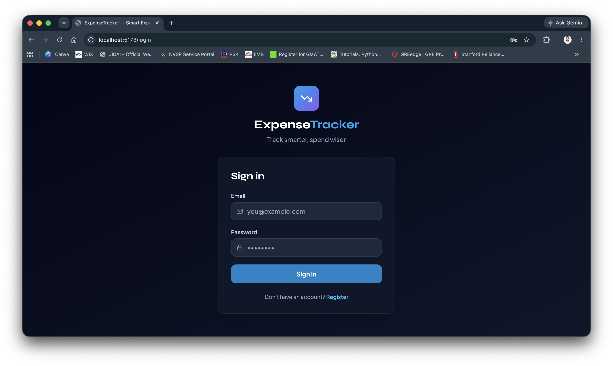
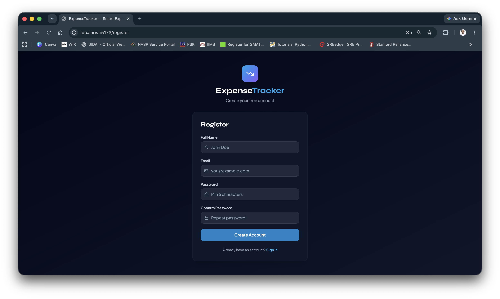
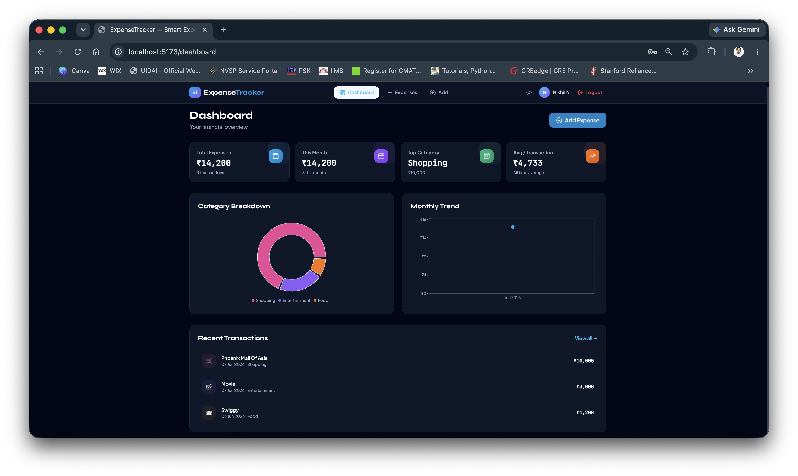
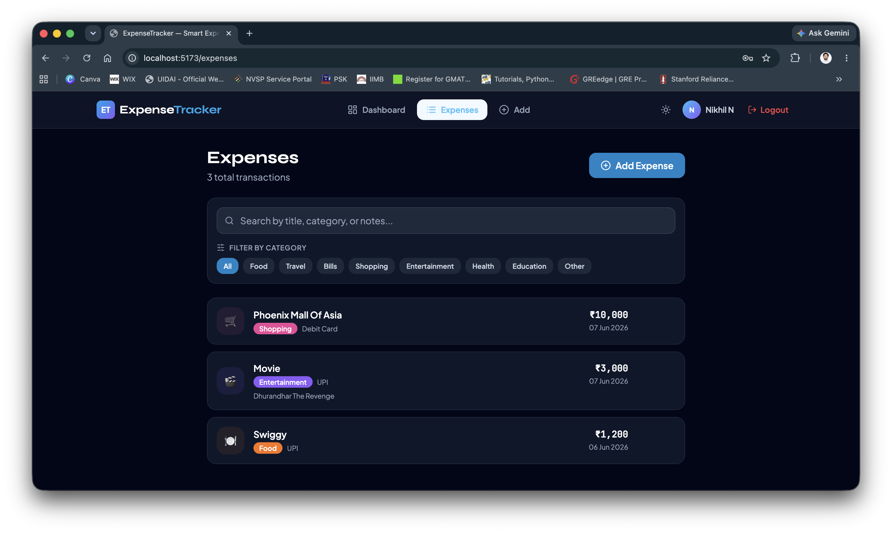
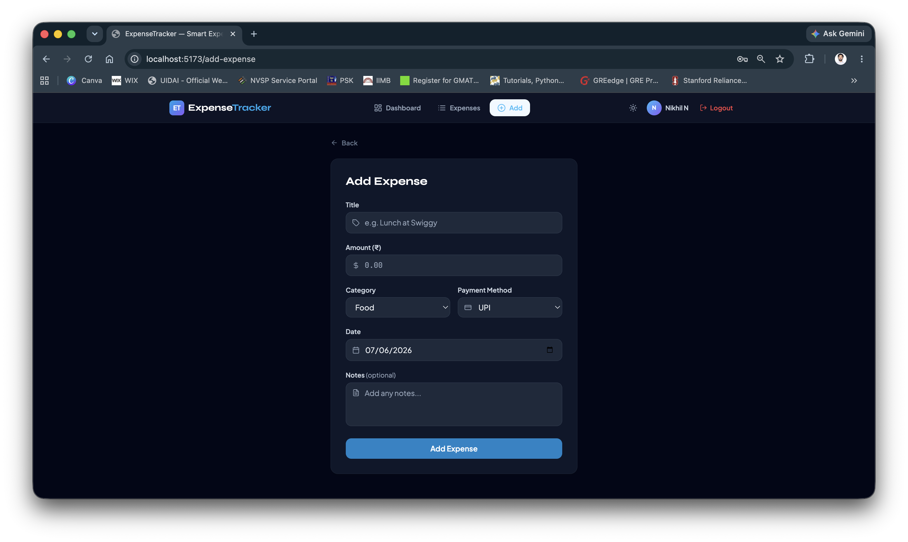

# ExpenseTracker — Full Stack Expense Tracker

ExpenseTracker is a full-stack web application that helps users track and manage their daily expenses. Users can securely register and log in, record expenses, categorize transactions, search and filter expense history, and visualize spending patterns through an interactive dashboard.

The application is built using the MERN stack (MongoDB, Express.js, React, and Node.js) and includes JWT-based authentication, responsive design, dark mode support, and data visualization using charts.

---

## ✨ Features

### Core
- ➕ **Add / Edit / Delete** expenses
- 📋 **Expense History** with paginated list view
- 🔍 **Search** by title, category, or notes
- 🏷️ **Filter** by category (Food, Travel, Bills, etc.)
- ✅ **Form Validation** on both frontend & backend

### Dashboard
- 💰 Total expenses (all time)
- 📅 Monthly expense summary
- 🕐 Recent transactions
- 📊 **Pie Chart** — Category-wise breakdown
- 📈 **Line Chart** — Monthly spending trend

### Bonus
- 🔐 **JWT Authentication** — Register / Login
- 🌙 **Dark Mode** — persists across sessions
- 📱 **Responsive UI** — works on mobile and desktop

---

## 📸 Screenshots

### Login Page


### Register Page


### Dashboard


### Expense History


### Add Expense


---

## 🛠 Tech Stack

| Layer     | Technology                              |
|-----------|-----------------------------------------|
| Frontend  | React 18, React Router v6, Tailwind CSS |
| Charts    | Recharts                                |
| HTTP      | Axios                                   |
| Backend   | Node.js, Express.js                     |
| Auth      | JWT (jsonwebtoken), bcryptjs            |
| Database  | MongoDB + Mongoose                      |
| Deployment| Vercel (frontend), Render (backend)     |

---

## 📁 Folder Structure

```
expense-tracker/
├── client/                   # React frontend
│   └── src/
│       ├── pages/            # Login, Register, Dashboard, Expenses, Add/Edit
│       ├── components/       # Navbar, ExpenseCard, ExpenseForm, StatCard...
│       ├── context/          # AuthContext, ThemeContext
│       ├── services/         # Axios API calls
│       └── utils/            # helpers, constants
└── server/                   # Node.js backend
    ├── models/               # User, Expense mongoose schemas
    ├── routes/               # auth, expenses, dashboard routes
    ├── controllers/          # business logic
    ├── middleware/           # JWT protect middleware
    └── config/               # DB connection
```

---

## ⚙️ Setup Instructions

### Prerequisites
- Node.js v18+
- MongoDB Atlas account (free tier works)
- Git

---

### 1. Clone the Repository

```bash
git clone https://github.com/nikhil1905-n/<repository-name>.git
cd <repository-name>
```

---

### 2. Backend Setup

```bash
cd server
npm install
```

Create a `.env` file:
```bash
cp .env.example .env
```

Edit `.env`:
```
PORT=5001
MONGO_URI=mongodb+srv://<user>:<pass>@cluster0.xxxxx.mongodb.net/expense-tracker
JWT_SECRET=your_very_secret_key_here
CLIENT_URL=http://localhost:5173
```

Start backend:
```bash
npm run dev   # with nodemon (development)
npm start     # production
```

---

### 3. Frontend Setup

```bash
cd ../client
npm install
```

Create a `.env` file:
```bash
cp .env.example .env
```

Edit `.env`:
```
VITE_API_URL=http://localhost:5001/api
```

Start frontend:
```bash
npm run dev
```

Visit: **http://localhost:5173**

---

## 📡 API Documentation

### Auth

| Method | Endpoint              | Description           | Auth |
|--------|-----------------------|-----------------------|------|
| POST   | /api/auth/register    | Register new user     | ❌   |
| POST   | /api/auth/login       | Login, returns token  | ❌   |
| GET    | /api/auth/me          | Get current user      | ✅   |

### Expenses

| Method | Endpoint              | Description                        | Auth |
|--------|-----------------------|------------------------------------|------|
| POST   | /api/expenses         | Create expense                     | ✅   |
| GET    | /api/expenses         | Get all (search, filter, paginate) | ✅   |
| GET    | /api/expenses/:id     | Get single expense                 | ✅   |
| PUT    | /api/expenses/:id     | Update expense                     | ✅   |
| DELETE | /api/expenses/:id     | Delete expense                     | ✅   |

**Query params for GET /api/expenses:**
- `search` — search text
- `category` — filter by category
- `page` — page number (default: 1)
- `limit` — items per page (default: 10)
- `sortBy` — field to sort (default: expenseDate)
- `order` — asc | desc (default: desc)

### Dashboard

| Method | Endpoint         | Description          | Auth |
|--------|------------------|----------------------|------|
| GET    | /api/dashboard   | Dashboard summary    | ✅   |

---

## 🚀 Deployment

### Frontend → Vercel

1. Push your repo to GitHub
2. Go to [vercel.com](https://vercel.com) → New Project → Import repo
3. Set **Root Directory** to `client`
4. Add environment variable: `VITE_API_URL=https://your-backend.onrender.com/api`
5. Deploy!

### Backend → Render

1. Go to [render.com](https://render.com) → New Web Service → Connect repo
2. Set **Root Directory** to `server`
3. Set **Build Command**: `npm install`
4. Set **Start Command**: `npm start`
5. Add Environment Variables:
   - `MONGO_URI` = your MongoDB Atlas URI
   - `JWT_SECRET` = your secret key
   - `CLIENT_URL` = your Vercel frontend URL
6. Deploy!

---

## 📋 Categories

`Food` · `Travel` · `Bills` · `Shopping` · `Entertainment` · `Health` · `Education` · `Other`

## 💳 Payment Methods

`Cash` · `Credit Card` · `Debit Card` · `UPI` · `Net Banking` · `Other`

---

## 👨‍💻 Author

Nikhil N

- GitHub: https://github.com/nikhil1905-n
- LinkedIn: https://linkedin.com/in/nikhil-19